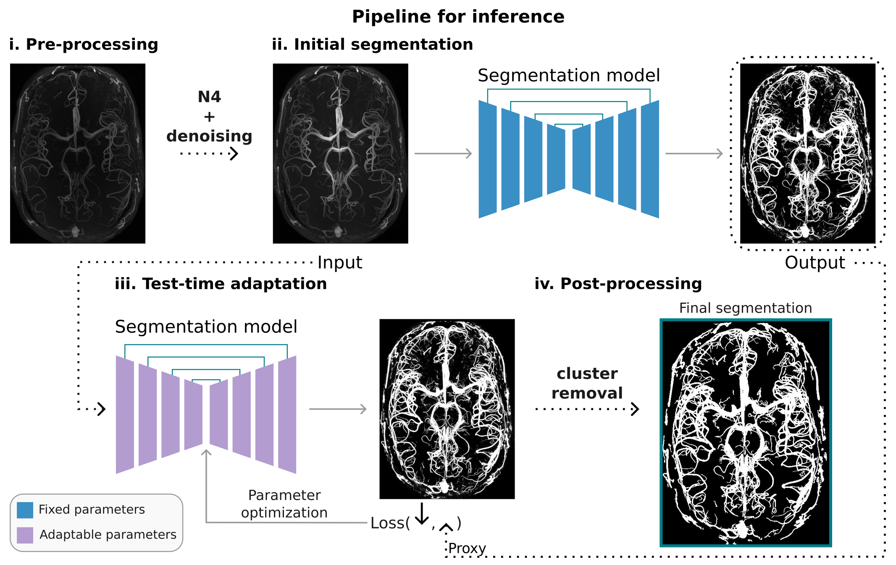

# **Vessel Boost**
This repository contains functional modules and stand-alone scripts for Vessel Boost.
## **Table of Contents**
- [Purpose](https://github.com/KMarshallX/vessel_code#purpose)
- [Current Version](https://github.com/KMarshallX/vessel_code#current-version)
- [Installation & Requirements](https://github.com/KMarshallX/vessel_code#installation--requirements)
- [Citation](https://github.com/KMarshallX/vessel_code#citation)
- [Contact](https://github.com/KMarshallX/vessel_code#contact)

## **Purpose**
*Vessel Boost* is a UNet3D-based segmentation pipeline that utilizes data augmentation and test-time adaptation (TTA) to enhance segmentation quality and is generally applicable to high-resolution magnetic resonance angiograms (MRAs).\
This repository contains 3 major modules: 
1. [Initial training](https://github.com/KMarshallX/vessel_code/blob/master/documentation/train_readme.md). You can use this module to train your own base model.
2. [Inference](https://github.com/KMarshallX/vessel_code/blob/master/documentation/infer_readme.md). This module takes one pre-trained model for inference on the MRA data you provide. It can be used to generate intermediate proxy segmentations as well as the final ones.
3. [Test-time-adaptation](https://github.com/KMarshallX/vessel_code/blob/master/documentation/tta_readme.md). This module takes a pre-trained model and specified proxies for model adaptation. If no proxies are provided, this module will generate proxies automatically.
<p align="center">

</p>

### *Pipeline overview*

The complete pipeline will firstly train an intial model on the provided high resolution MRAs, or you can directly use our pre-trained models. The pre-trained models will be used to infer intermediate segmentations (proxies) of the images you want to process. Lastly, a test-time-adaptation (TTA) process will be conducted based on the chosen pre-trained model and proxies.
## **Current Version**
VesselBoost 0.9.1
## **Installation & Requirements**
This is a Pytorch based project, for successfully running this project on your local machine, please follow the following steps to set up necessary sofware environment.
1. Make sure your local machine has Nvidia GPU(s) and CUDA installed 
2. Clone this repository to your local machine
    ```
    git clone https://github.com/KMarshallX/vessel_code.git
    ```
3. Install miniconda:
    ```
    cd vessel_code
    bash miniconda-setup.sh
    ```
4. Then set your current working directory as the cloned repository, and install the remaining required packages
    ```
    conda env create -f environment.yml
    source activate vessel_boost
    ```


Done. Happy tuning!


## **Citation**
...

## **Contact**
...

