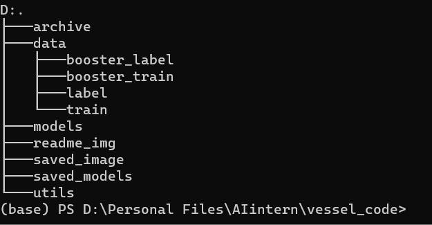
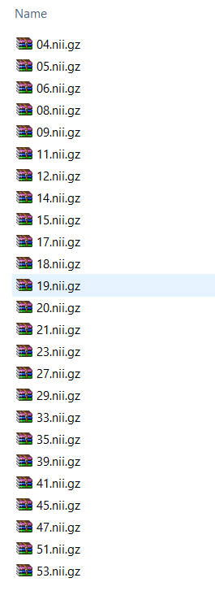
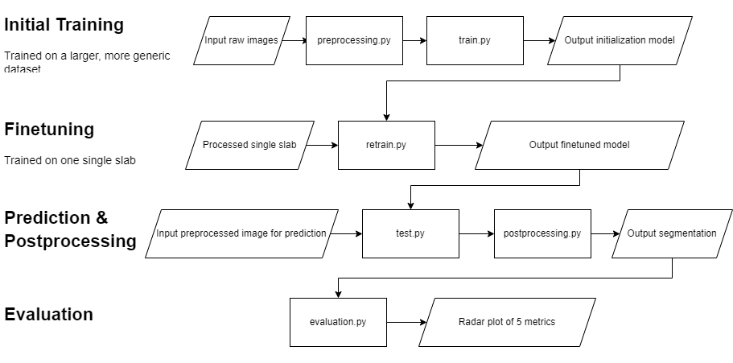
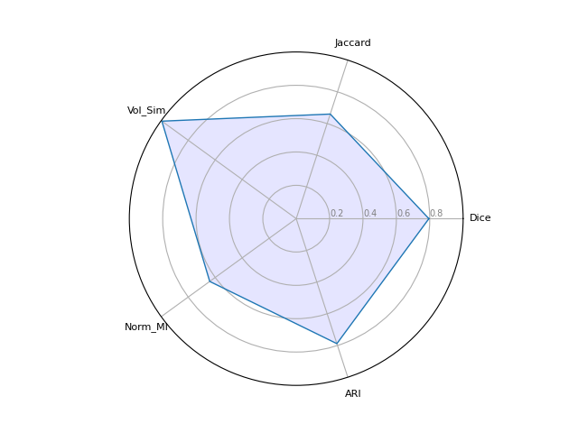

# **Vessel Code**
**This repository is only used for storing code, not for data/saved images/pretrained models.**
## **Software requirements**
1. python 3.9 or later
2. pytorch = 1.13
3. matplotlib = 3.6
4. nibabel = 4.0.2
5. numpy = 1.23.5
6. patchify = 0.2.3
7. scikit-learn = 1.1.1
8. scipy = 1.9.3
9. tqdm = 4.64.1

## **Before continue reading**
This program is quite sensitive to directory sturcture, and the naming convention of input image slabs, as I currently used some dumb but convenient way to match the input image with its corresponding label. Thus when you run this program locally, please keep the directory structure like the one shown below (1. folders within **_data_** can have customized names, apart from that, please keep the naming of other folders; 2. ignore **_archive_**):
<p align="center">

</p>
Also, please keep all of the image data named like this (both images and their ground truth labels):
<p align="center">

</p>

## **Working pipeline**
As this python-based software is not fully-developed, it cannot run with 'one click', there are 5 stand-alone parts of this pipeline, below attached a box diagram dipicts the overall procedure.

The next section will introduce each of the stand-alone part of this working pipeline.
## **Stand-alone files**
### preprocessing.py
(This file is currently not CLI)\
Input:
1. path to the raw images to be preprocessed e.g. "./data/train/"
2. path to save the preprocessed images e.g. "./data/bfc_denoised_data/"

Output:\
Bias field corrected & denoised images

Current problems:\
This file works good on the challenge dataset, but could encounter memory overflow error on pial artetial vasculature image sets. For the pial arterial vasculature set (From Saskia), please use _preprocess_pial_img.py_ instead. 
### train.py
**Train the chosen model on a larger dataset, and the output model will be used as an initialization**\
Command line: (_below only attached frequently used hyperparameters, these are safe to tune, for more tunable hyperparameters and detailed description of each command, please refer to --help. However, changing the hyperparams that are unlisted below may lead to catastrophic problems_)
<pre>
command             comment(within square brackets [] are optional arguments)
--mo                set the model type for training, defualt is "unet3d".["aspp", "atrous"]
--loss_m            loss metrics, default is "bce". ["dice"]
--op                optimizer, default is "adam".["sgd"]
--optim_step        default is 5000. For every 5000 epochs, decays the learning rate of each parameter group by optim_gamma
--optim_gamma       default is 0.5. Decays the learning rate of each parameter group by this ratio
--ep                number of epochs for training, default is 5000.
--lr                learning rate for traning, default is 1e-3.
--inimg             relative path to input images, e.g. "./data/image"
--inlab             relative path to input ground truth, e.g. "./data/label"
--aug_mode          default is "mode1". Augmentation mode for each patch before fed into the model
--outmo             relative path to the output model. e.g. "./saved_models/model_name".
</pre>
Normally, the command attached below would be sufficient:
```
python train.py --outmo "./saved_models/model_name" --mo "unet3d" --lr 1e-3 --ep 5000 --aug_mode "mode1" --optim_step 2500 --optim_gamma 0.5 --inimg "./data/image/" --inlab "./data/label/"
```

### retrain.py
**Retrain the initialization model on a small set (single slab) for finetuning**\
Command line: Very similar to _train.py_, the only difference is user has to specify the location of the initialization mode by calling --tm
<pre>
command             comment
--tm                relative path to the initialization (pretrained) model, e.g. "./saved_models/pretrained_model_name" 
</pre>
In consistency with the previous section, below attached the command example for normal use:
```
python retrain.py --tm "./saved_models/pretrained_model_name" --outmo "./saved_models/model_name" --mo "unet3d" --lr 1e-3 --ep 5000 --aug_mode "mode1" --optim_step 2500 --optim_gamma 0.5 --inimg "./data/booster_image/" --inlab "./data/booster_label/"
```

### test.py
**Use the finetuned model to make prediciton, outputs the 3D probability map**
Command line:
<pre>
command             comment
--tinimg            relative path to the input image for prediciton, e.g."./data/validate/"
--tm                relative path to the finetuned model, e.g. "./saved_models/finetuned_model_name" 
--outim             name of the output probability image, the output image could be found under folder "./saved_image/", e.g. "output_image"
</pre>
Command example:
```
python test.py --tm "finetuning_model" --tinimg "./data/validate/" --outim "test_image_name"
```
**Please Note:** This file is not fully CLI, if the folder contains more than 1 image slab for prediction,  please manually tune the second argument (which is 1 shown below) in line 45, the name of the file used for prediction will be printed in the output log. If the folder contains only 1 image, make the second argument 0.
```
verification(raw_path, 1, load_model, out_img_name, mode='sigmoid')
```

### postprocessing.py
**Taking the 3D probability map, and output the segmentation image to the same folder where the probability map is stored**
Command line:
<pre>
command             comment
--outim_path        relative path to folder in which you saved the probability map, e.g."./saved_image/"
--outim             name of the output probability image, the output image could be found under folder "./saved_image/", e.g. "output_image"
--img_name          name of the output segmentation and its corresponding maximum intensity projection
</pre>
Command example:
```
python postprocessing.py --outim_path "./saved_image/" --outim "test_image_name" --img_name "result_segmentation"
```
**Please Note:** This file is not fully CLI, the thresholding value and the connected component size threshold needs to be manually tuned in line 46:
```
processed_img = post_processing_pipeline(sig_arr, thresh=0.3, connect_threshold=120)
```

### evaluation.py
**Comparing the segmentation and ground truth by using 5 metrics: dice score, jaccard score, normalized mutual information, volume similarity, balanced average hausdorff distance. Displays the 5 scores in the console (or the output log), and display a radar plot. (As currently we don't have a functional hausdorff fucntion, it is now been replaced by adjusted rand index)**\
_(This file is currently not CLI, and not recommended for Non-gui linux environment)_\
Example:
<p align="center">

</p>
