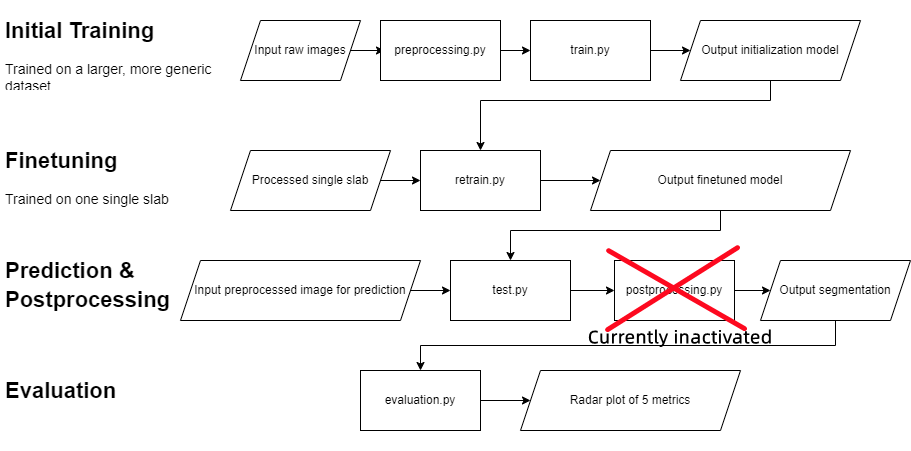
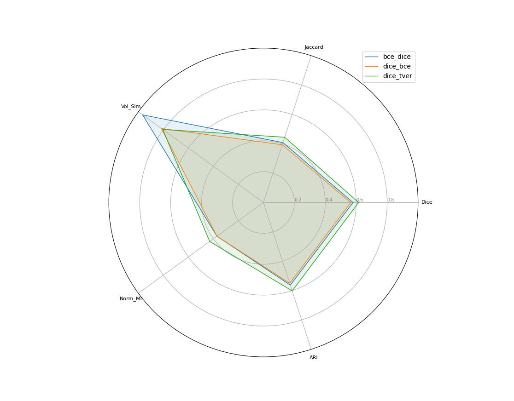
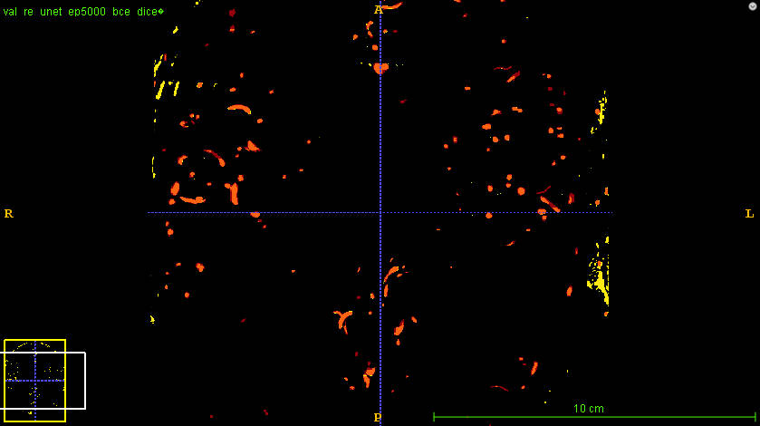
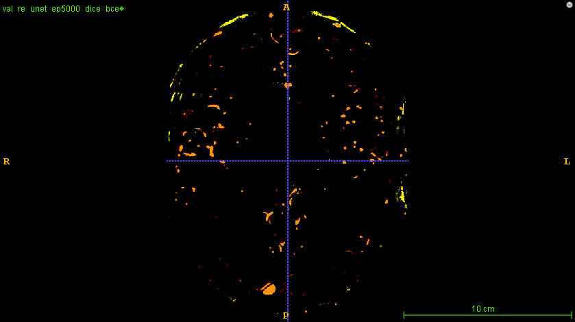
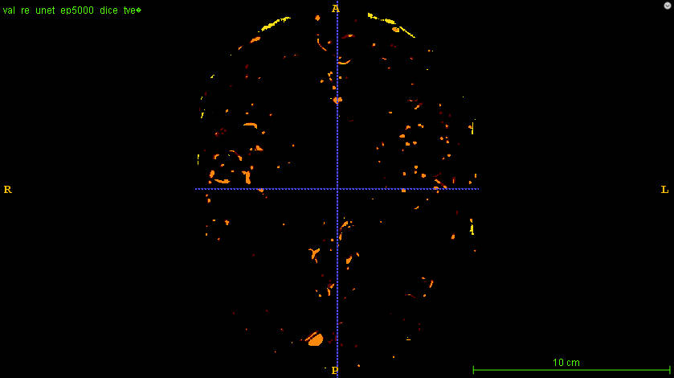

# **Vessel Code**
**This repository is only used for storing code, not for data/saved images/pretrained models.**
## **Software requirements**
1. python 3.9 or later
2. pytorch = 1.13
3. matplotlib = 3.6
4. nibabel = 4.0.2
5. numpy = 1.23.5
6. patchify = 0.2.3
7. scikit-learn = 1.1.1
8. scipy = 1.9.3
9. tqdm = 4.64.1
10. antspyx = 0.3.7
11. connected-components-3d = 3.10.5

## **Update**
### 03/07/2023:
1. update evaluate metrics, it now can calculate the scores directly between ground truth (0s, 1s) and output probability map (0~1).
2. postprocessing.py inactivated for further testing.

### 03/14/2023:
1. Except Evaluation.py, all .py files should be runnable with CLI
2. Train.py & Retrain.py: deprecated step learning rate scheduler, implemented ReduceLROnPlateau scheduler
3. Retrain.py: save the checkpoint (dictionary state) every 1000 epoch. Note: if the total epoch number % 1000 == 0, then the last two saved checkpoints would be the same.


## **Before continue reading**
This program is quite sensitive to directory sturcture, and the naming convention of input image slabs, as I currently used some dumb but convenient way to match the input image with its corresponding label. Thus when you run this program locally, please keep the directory structure like the one shown below (1. folders within **_data_** can have customized names, apart from that, please keep the naming of other folders; 2. ignore **_archive_**):
<p align="center">

</p>
Also, please keep all of the image data named like this (both images and their ground truth labels):
<p align="center">

</p>

## **Working pipeline**
As this python-based software is not fully-developed, it cannot run with 'one click', there are 5 stand-alone parts of this pipeline, below attached a box diagram dipicts the overall procedure.

The next section will introduce each of the stand-alone part of this working pipeline.
## **Stand-alone files**
### preprocessing.py
**Takes the raw images and conduct bias field correction and denoising proccess**\
Command line:
<pre>
command             comment(within square brackets [] are optional arguments)
--input_path        input image path, default = "./insert/your/path/to/the/raw/images/like/this/"
--output_path       output processed image directory, default = "./insert/a/path/you/wish/to/store/processed/images/"
</pre>

Output:\
Bias field corrected & denoised images

Current problems:\
This file works good on the challenge dataset, but could encounter memory overflow error on pial artetial vasculature image sets. For the pial arterial vasculature set (From Saskia), please use _preprocess_pial_img.py_ instead. 
### train.py
**Train the chosen model on a larger dataset, and the output model will be used as an initialization**\
Command line: (_below only attached frequently used hyperparameters, these are safe to tune, for more tunable hyperparameters and detailed description of each command, please refer to --help. However, changing the hyperparams that are unlisted below may lead to catastrophic problems_)
<pre>
command             comment(within square brackets [] are optional arguments)
--mo                set the model type for training, defualt is "unet3d".["aspp", "atrous"]
--loss_m            loss metrics, default is "bce". ["dice", "tver"]
--op                optimizer, default is "adam".["sgd"]
--optim_patience    Number of epochs with no improvement after which learning rate will be reduced. For example, if patience = 2, then we will ignore the first 2 epochs with no improvement, and will only decrease the LR after the 3rd epoch if the loss still hasn’t improved then. Default: 10.
--optim_gamma       default is 0.5. Decays the learning rate of each parameter group by this ratio
--ep                number of epochs for training, default is 5000.
--lr                learning rate for traning, default is 1e-3.
--inimg             relative path to input images, e.g. "./data/image"
--inlab             relative path to input ground truth, e.g. "./data/label"
--aug_mode          default is "mode1". Augmentation mode for each patch before fed into the model
--outmo             relative path to the output model. e.g. "./saved_models/model_name".
</pre>
Normally, the command attached below would be sufficient:
```
python train.py --outmo "./saved_models/model_name" --mo "unet3d" --lr 1e-3 --ep 5000 --aug_mode "mode1" --loss_m "dice" --optim_patience 50 --optim_gamma 0.98 --inimg "./data/image/" --inlab "./data/label/"
```

### retrain.py
**Retrain the initialization model on a small set (single slab) for finetuning**\
Command line: Very similar to _train.py_, the only difference is user has to specify the location of the initialization mode by calling --tm
<pre>
command             comment
--inimg             relative path to the test image, e.g. "./data/image_folder/"
--inlab             relative path to the proxy of the test image, e.g. "./data/proxy_folder/"
--tm                relative path to the initialization (pretrained) model, e.g."./saved_models/pretrained_model_name" 
--retrain_name      Name prefix of retrained checkpoints
--mo                choose the same model as the initial model
--lr                initial learning rate
--ep                number of epochs
--optim_patience    (same as train.py)
--optim_gamma       (same as train.py)
--loss_m            loss metrics
</pre>
In consistency with the previous section, below attached the command example for normal use:
```
python retrain.py --tm "./saved_models/pretrained_model_name" --retrain_name "finetuning_model_name_prefix" --mo "unet3d" --lr 1e-3 --ep 5000 --aug_mode "mode1" --optim_patience 50 --optim_gamma 0.98 --inimg "./data/test_image_folder/" --inlab "./data/test_proxy_folder/"
```

### test.py
**Use the finetuned model to make prediciton, outputs the 3D probability map**\
Command line:
<pre>
command             comment
--tm                name of the finetuned model, e.g. "finetuned_model_name" 
--tinimg            relative path to the input image for prediciton, e.g."./data/validate/"
--outim             name of the output probability image, the output image could be found under folder "./saved_image/"
--img_idx           index of the image file to be used for prediction, default is 0 (the first file in the given directory)
</pre>
Command example:
```
python test.py --tm "finetuning_model" --tinimg "./data/validate/" --outim "test_image_name" --img_idx 0
```


### postprocessing.py 
**Taking the 3D probability map, and output the segmentation image to the same folder where the probability map is stored.**\
Command line:
<pre>
command             comment
--outim_path        relative path to folder in which you saved the probability map, e.g."./saved_image/"
--outim             name of the output probability image, the output image could be found under folder "./saved_image/", e.g. "output_image"
--img_name          name of the output segmentation and its corresponding maximum intensity projection
--thresh_vector     pass TWO integers to the postprocessing procedure. The first integer is the threshold percentile for hard thresholding, recommended value is 5 (5%); the second one is the minimum size of the components in the final image, any components below this size will be wiped out.
</pre>
Command example:
```
python postprocessing.py --outim_path "./saved_image/" --outim "test_image_name" --img_name "result_segmentation" --thresh_vector 0.05 20
```

### evaluation.py
**Comparing the segmentation and ground truth by using 5 metrics: dice score, jaccard score, normalized mutual information, volume similarity, balanced average hausdorff distance. Displays the 5 scores in the console (or the output log), and display a radar plot. (As currently we don't have a functional hausdorff fucntion, it is now been replaced by adjusted rand index)**\
_(This file is currently not CLI, and not recommended for Non-gui linux environment)_\
Example:
<p align="center">

</p>

## **Current Result**
The current pipeline is a supervised learning model: the initial model is trained on dataset with size of 25 files, the funetuning models are trained on sub007.nii in **_validate_label_**. File sub017.nii in **_validate_label_** is used as the test file for prediciton, as it has similar value distribution as sub007.nii which is used for finetuning.\
There are 3 loss metrics available at present: binary-cross-entropy, dice and tversky. There are initial models with bce and dice loss metrics (tversky model is under training), the retraining process applied dice, bce and tversky respectively. Below attached images display the results of the current working pipeline:\
**Note:** 
1. "bce_dice" means the initial model is trained with bce metric, the retraining process used dice loss, vice versa.
2. In segmentation images: <p style="color:#F04607;">orange = true positives</p> <p style="color:#F0EC07;">yellow = false positives</p> <p style="color:#C71810;">red = false negatives</p> 

<p align="center">

</p>

<p align="center">

</p>
<p align="center">

</p>
<p align="center">

</p>
