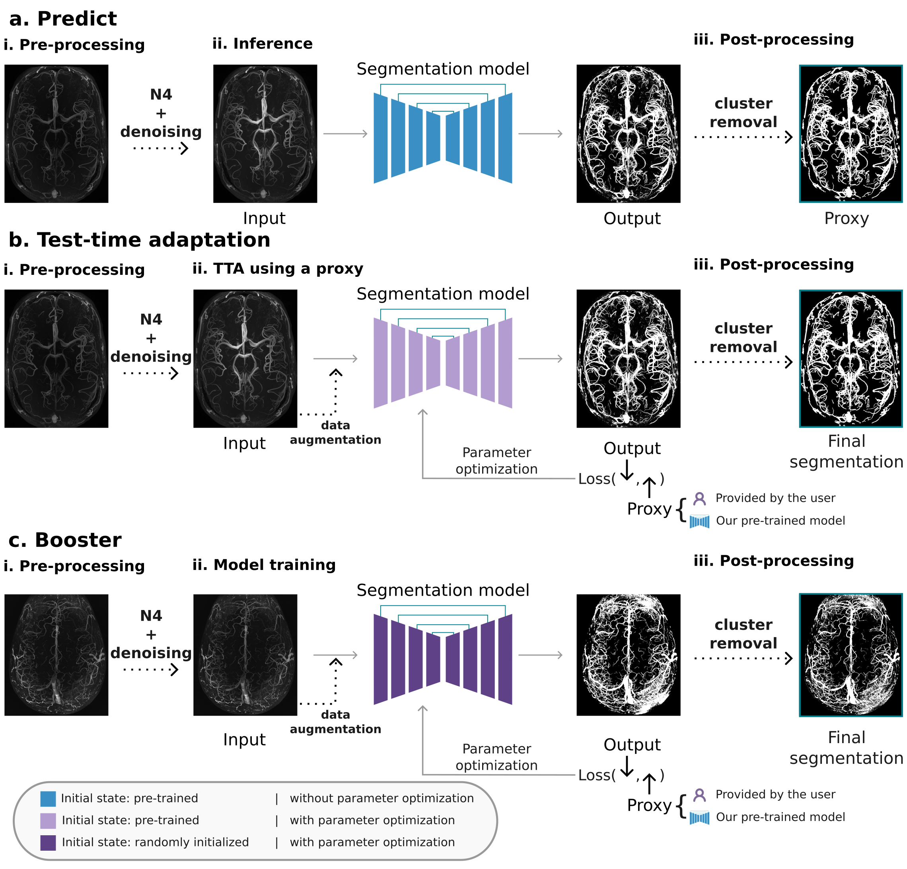

# **VesselBoost**
*VesselBoost* is a Python-based software package utilizing deep learning techniques to segment high-resolution time-of-flight MRI angiography data, with high sensitivity towards small vessels (An experimental pretrained model is available for T2*-weighted imaging). The software suite encompasses three essential functional modules: (1) *predict*, (2) *test-time adaptation* (TTA), and (3) *boost*. By leveraging these modules, users can efficiently segment high-resolution time-of-flight data or conveniently leverage our command line interface to boost segmentations for other vascular MRI image contrasts.

## **Table of Contents**
- [Update History](#update-history)
- [Purpose](#purpose)
- [Current Version](#current-version)
- [Requirements](#requirements)
- [Software container](#software-container)
- [Installation](#installation)
- [Citation](#citation)
- [Contact](#contact)

## **Update History**
- **1.0.0**: Initial release, for details see [Citation](#citation)
- **2.0.0 - pre-release**: for details see [Update Log - 16/Sept/2025](documentation/UPDATE.md)

## **Purpose**
*VesselBoost* is a Python-based software package leveraging a UNet3D-based segmentation pipeline that utilizes data augmentation and test-time adaptation (TTA) to enhance segmentation quality and is generally applicable to high-resolution magnetic resonance angiograms (MRAs).\
This repository contains 3 major modules: 

1. [Predict](https://github.com/KMarshallX/vessel_code/blob/master/documentation/predict_readme.md). With this module, users can segment high-resolution time-of-flight using our pre-trained models. It can be used to generate intermediate proxy segmentations as well as the final ones.
2. [Test-time-adaptation](https://github.com/KMarshallX/vessel_code/blob/master/documentation/tta_readme.md). This module allows the user to provide a proxy segmentation or generate a proxy with our pre-trained model (Module 1), to drive further adaptation of the pre-trained models.
3. [Booster](https://github.com/KMarshallX/vessel_code/blob/master/documentation/boost_readme.md). *Boost* allows users to train a segmentation model on a single or more data using existing imperfect segmentation.

<p align="center">

</p>


## **Current Version**
VesselBoost 2.0.0

## **Requirements**
- Docker / Singularity container

## **Software container**

VesselBoost, pre-trained models, and required software are packaged in software containers available through Dockerhub and [Neurodesk](https://www.neurodesk.org/).

### **Docker**

The Dockerhub container is available at Dockerhub. To download the container, run the following command:

```
docker pull vnmd/vesselboost_2.0.0
```

### Neurodesk 
To predict vessel segmentation using your data and the latest version of VesselBoost on Neurodesk, you can run the following code snippet:

```bash
ml vesselboost
path_to_model=/cvmfs/neurodesk.ardc.edu.au/containers/vesselboost_2.0.0_20250916/vesselboost_2.0.0_20250916.simg/opt/VesselBoost/saved_models/
prediction.py --image_path /path/ --output_path /path/ --pretrained "$path_to_model"/BM_VB2_aug_all_ep2k_bat_10_0903 --prep_mode 4
```

For more information, please check our [notebooks](https://github.com/KMarshallX/VesselBoost/tree/master/notebooks).

## **Installation**
This is a Python-based software package. To successfully run this project on your local machine, please follow the following steps to set up the necessary software environment.

1. Clone this repository to your local machine
    For latest version:
    ```
    git clone https://github.com/KMarshallX/VesselBoost.git

    ```
    To clone the previous version (VesselBoost 1.0.0):
    ```
    git clone -b stable_ver_1_0_0_hpc --single-branch https://github.com/KMarshallX/VesselBoost.git
    ```

2. Install miniconda:
    ```
    cd VesselBoost
    bash miniconda-setup.sh
    ```
3. Then set your current working directory as the cloned repository, and install the remaining required packages
    ```
    conda env create -f environment.yml
    conda activate vessel_boost
    ```

3. (CI or CPU-only) If you run the CI tests or run VesselBoost on a CPU-only machine, please install the CPU version of PyTorch by running the following command:
    ```
    conda env create -f environment-ci.yml
    conda activate vessel_boost
    ```

## **Citation**
VesselBoost paper is now published! Please cite us if you use VesselBoost in your research:

```
@article{xuVesselBoostPythonToolbox2024a,
  title = {{{VesselBoost}}: {{A Python Toolbox}} for {{Small Blood Vessel Segmentation}} in {{Human Magnetic Resonance Angiography Data}}},
  shorttitle = {{{VesselBoost}}},
  author = {Xu, Marshall and Ribeiro, Fernanda L. and Barth, Markus and Bernier, Micha{\"e}l and Bollmann, Steffen and Chatterjee, Soumick and Cognolato, Francesco and Gulban, Omer F. and Itkyal, Vaibhavi and Liu, Siyu and Mattern, Hendrik and Polimeni, Jonathan R. and Shaw, Thomas B. and Speck, Oliver and Bollmann, Saskia},
  year = {2024},
  month = sep,
  journal = {Aperture Neuro},
  volume = {4},
  publisher = {Organization for Human Brain Mapping},
  issn = {2957-3963},
  doi = {10.52294/001c.123217},
  urldate = {2024-09-17},
  copyright = {http://creativecommons.org/licenses/by/4.0},
  langid = {english}
}
```

## **Contact**
Marshall Xu <[marshall.xu@uq.edu.au](marshall.xu@uq.edu.au)>

Saskia Bollmann <[saskia.bollmann@uq.edu.au](saskia.bollmann@uq.edu.au)>

Fernanda Ribeiro <[fernanda.ribeiro@uq.edu.au](fernanda.ribeiro@uq.edu.au)>

