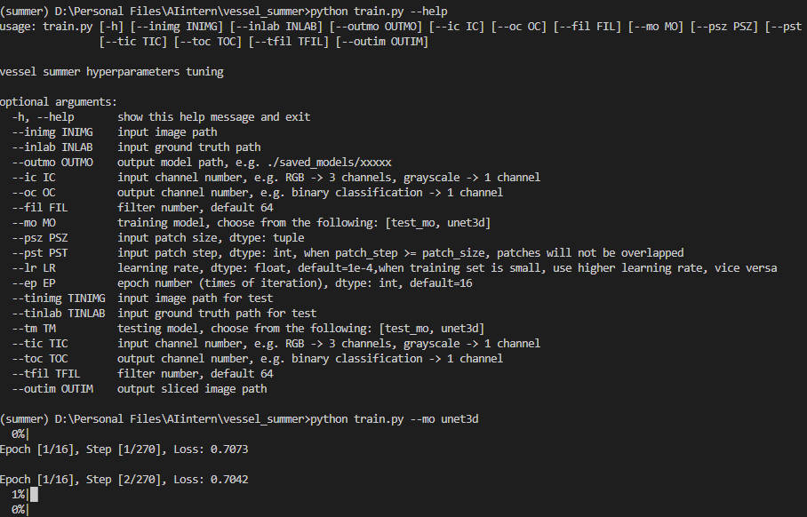
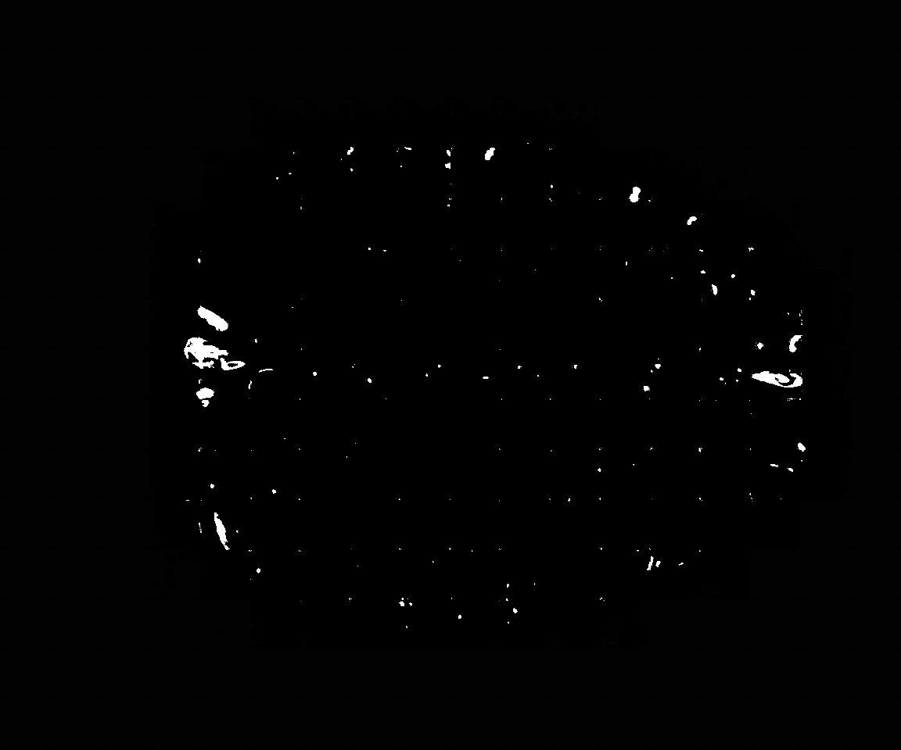
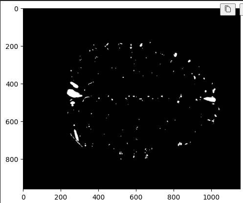
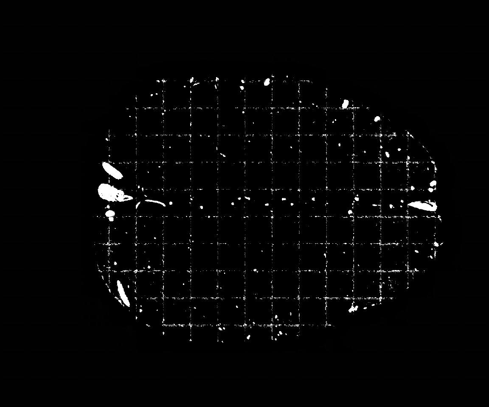

# Vessel Summer Code
This repo is only for updating and storing source code, not data/saved models/images.

## Runnable in CLI

## The model is debugged, but needs further optimization
The vessels can be distinguished from the output:\

However, the output is not best:\
\

## Week 3 update:
1. Implemented augmentation (rotation for now)
2. Implemented dice loss (testing)
3. Using slab pool as training set

## Current problems:
1. Zooming of single input patch (e.g. 64*64*54 -> 64*64*64)
2. Optimal epoch number and learning rate
3. https://drive.google.com/drive/u/0/folders/1Ty5B-qa339aCOvK15aeBKttGOmxtRzII