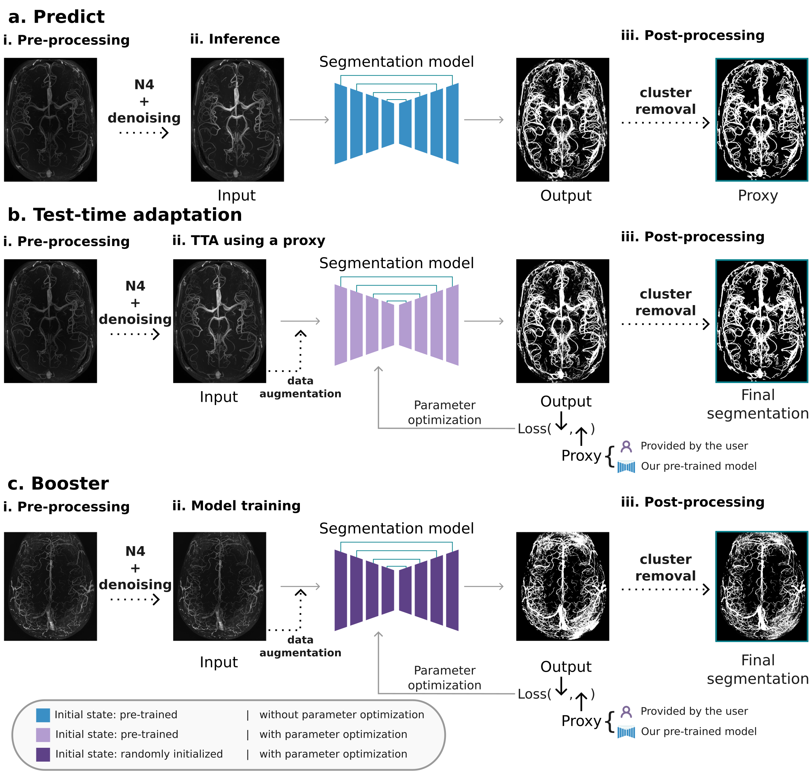
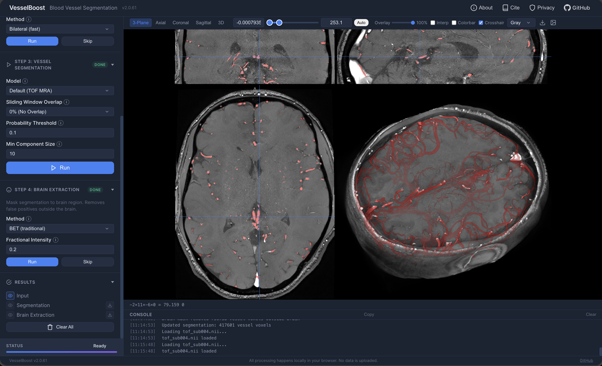

# **VesselBoost**

*VesselBoost* is a Python-based software package utilizing deep learning techniques to segment high-resolution time-of-flight MRI angiography data, with high sensitivity towards small vessels (An experimental pretrained model is available for T2*-weighted imaging). The software suite encompasses three essential functional modules: (1) *predict*, (2) *test-time adaptation* (TTA), and (3) *boost*. By leveraging these modules, users can efficiently segment high-resolution time-of-flight data or conveniently leverage our command line interface to boost segmentations for other vascular MRI image contrasts.

## **Table of Contents**

- [Update History](#update-history)
- [Purpose](#purpose)
- [Current Version](#current-version)
- [Requirements](#requirements)
- [Software container](#software-container)
- [Installation](#installation)
- [Citation](#citation)
- [Contact](#contact)

## **Update History**

- **2.0.5 - patch release**: for details see [Update Log - 17/Aug/2026](documentation/UPDATE.md)
- **1.0.0**: Initial release, for details see [Citation](#citation)

## **Purpose**

*VesselBoost* is a Python-based software package leveraging a UNet3D-based segmentation pipeline that utilizes data augmentation and test-time adaptation (TTA) to enhance segmentation quality and is generally applicable to high-resolution magnetic resonance angiograms (MRAs).This repository contains 3 major modules:

1. [Predict](https://github.com/KMarshallX/vessel_code/blob/master/documentation/predict_readme.md). With this module, users can segment high-resolution time-of-flight using our pre-trained models. It can be used to generate intermediate proxy segmentations as well as the final ones.
2. [Test-time-adaptation](https://github.com/KMarshallX/vessel_code/blob/master/documentation/tta_readme.md). This module allows the user to provide a proxy segmentation or generate a proxy with our pre-trained model (Module 1), to drive further adaptation of the pre-trained models.
3. [Booster](https://github.com/KMarshallX/vessel_code/blob/master/documentation/boost_readme.md). *Boost* allows users to train a segmentation model on a single or more data using existing imperfect segmentation.

<p align="center">

</p>

## **Current Version**

VesselBoost 2.0.5

## **Requirements**

- Docker / Singularity container

## **Availability**

### **Docker**

The Dockerhub container is available at Dockerhub. To download the container, run the following command:

```
docker pull vnmd/vesselboost_2.0.1
```

### **Neurodesk**

To predict vessel segmentation using your data and the latest version of VesselBoost on [Neurodesk](https://www.neurodesk.org/), you can run the following code snippet:

```bash
ml vesselboost
path_to_model=/cvmfs/neurodesk.ardc.edu.au/containers/vesselboost_2.0.0_20250916/vesselboost_2.0.0_20250916.simg/opt/VesselBoost/saved_models/
prediction.py --image_path /path/ --output_path /path/ --pretrained "$path_to_model"/manual_0429 --prep_mode 4
```

For more information, please check our [notebooks](https://github.com/KMarshallX/VesselBoost/tree/master/notebooks).

### **VesselBoost Webapp**

VesselBoost is also available as a web application. To access the webapp, please visit the [VesselBoost Webapp](https://vesselboost.neurodesk.org/).

<p align="center">

</p>

### **OpenRecon**

VesselBoost is also available on Siemens OpenRecon. To run VesselBoost on OpenRecon enabled scanners (>XA60), please refer to the [open recon container](https://github.com/neurodesk/neurocontainers/tree/main/recipes/vesselboost).

## **Installation**

This is a Python-based software package. To successfully run this project on your local machine, please follow the following steps to set up the necessary software environment.

1. Clone this repository to your local machine
   For latest version:

   ```
   git clone https://github.com/KMarshallX/VesselBoost.git
   ```

   To clone the previous version (VesselBoost 1.0.0):

   ```
   git clone -b stable_ver_1_0_0_hpc --single-branch https://github.com/KMarshallX/VesselBoost.git
   ```
2. Install Miniconda:

   ```
   cd VesselBoost
   bash miniconda-setup.sh
   ```
3. For a CUDA 12.6-capable NVIDIA GPU environment, create the GPU-focused Conda environment. This environment also includes the Jupyter notebook tools used by the examples:

   ```
   conda env create -f environment.yml
   conda activate vessel_boost
   ```

   The NVIDIA driver must support the CUDA 12.6 runtime bundled with the PyTorch wheel. Verify GPU access after installation with `python -c "import torch; print(torch.cuda.is_available())"`.
4. For CI or a CPU-only machine, create the CPU-focused Conda environment instead:

   ```
   conda env create -f environment-ci.yml
   conda activate vessel_boost_ci
   ```
5. Alternatively, `requirements.txt` provides the same CPU-focused runtime dependencies for an existing Python 3.10 virtual environment:

   ```
   python3.10 -m venv .venv
   source .venv/bin/activate
   python -m pip install --upgrade pip
   python -m pip install -r requirements.txt
   ```

The environments include `huggingface_hub` and its `hf` command-line client for downloading or publishing model files. The optional VesselBoost nnU-Net wrapper uses `dynamic-network-architectures` directly; the full `nnunetv2` package is not required.

### **Pretrained model weights**

Pretrained checkpoints are published in the [VesselBoost Hugging Face repository](https://huggingface.co/BrainVascuLab/VesselBoost). Download the primary TOF-MRA checkpoint with:

```bash
mkdir -p pretrained_models
hf download BrainVascuLab/VesselBoost \
  weights/manual_0429 \
  --revision f5cdbee052dde4f2a2a270674fd1c8d64dc8e861 \
  --local-dir pretrained_models
```

Use `pretrained_models/weights/manual_0429` as the `--pretrained` path. The revision pin identifies the exact checkpoint set used by the automated tests.

### **Brain extraction in offline environments**

Brain extraction uses [FreeSurfer&#39;s SynthStrip](https://github.com/freesurfer/freesurfer/tree/dev/mri_synthstrip) and requires the `synthstrip.1.pt` weights file. If the file is not available locally, VesselBoost tries to download it from the FreeSurfer server at runtime. When there is no internet connection and no local weights file, brain extraction fails with an error.

On a connected machine, download the weights into the standard VesselBoost location:

```
mkdir -p saved_models
curl -L \
  -o saved_models/synthstrip.1.pt \
  https://surfer.nmr.mgh.harvard.edu/docs/synthstrip/requirements/synthstrip.1.pt
```

If `curl` is unavailable, use `wget`:

```
wget \
  -O saved_models/synthstrip.1.pt \
  https://surfer.nmr.mgh.harvard.edu/docs/synthstrip/requirements/synthstrip.1.pt
```

For airgapped or offline deployments, copy `saved_models/synthstrip.1.pt` into the deployment image or runtime directory before running VesselBoost. Alternatively, set `VESSELBOOST_SYNTHSTRIP_WEIGHTS` to the weights file path or to the directory containing it.

## **Citation**

VesselBoost paper is now published! Please cite us if you use VesselBoost in your research:

```
@article{xuVesselBoostPythonToolbox2024a,
  title = {{{VesselBoost}}: {{A Python Toolbox}} for {{Small Blood Vessel Segmentation}} in {{Human Magnetic Resonance Angiography Data}}},
  shorttitle = {{{VesselBoost}}},
  author = {Xu, Marshall and Ribeiro, Fernanda L. and Barth, Markus and Bernier, Micha{\"e}l and Bollmann, Steffen and Chatterjee, Soumick and Cognolato, Francesco and Gulban, Omer F. and Itkyal, Vaibhavi and Liu, Siyu and Mattern, Hendrik and Polimeni, Jonathan R. and Shaw, Thomas B. and Speck, Oliver and Bollmann, Saskia},
  year = {2024},
  month = sep,
  journal = {Aperture Neuro},
  volume = {4},
  publisher = {Organization for Human Brain Mapping},
  issn = {2957-3963},
  doi = {10.52294/001c.123217},
  urldate = {2024-09-17},
  copyright = {http://creativecommons.org/licenses/by/4.0},
  langid = {english}
}
```

## **Contact**

Marshall Xu <[marshall.xu@uq.edu.au](marshall.xu@uq.edu.au)>

Saskia Bollmann <[saskia.bollmann@uq.edu.au](saskia.bollmann@uq.edu.au)>

Fernanda Ribeiro <[fernanda.ribeiro@uq.edu.au](fernanda.ribeiro@uq.edu.au)>
