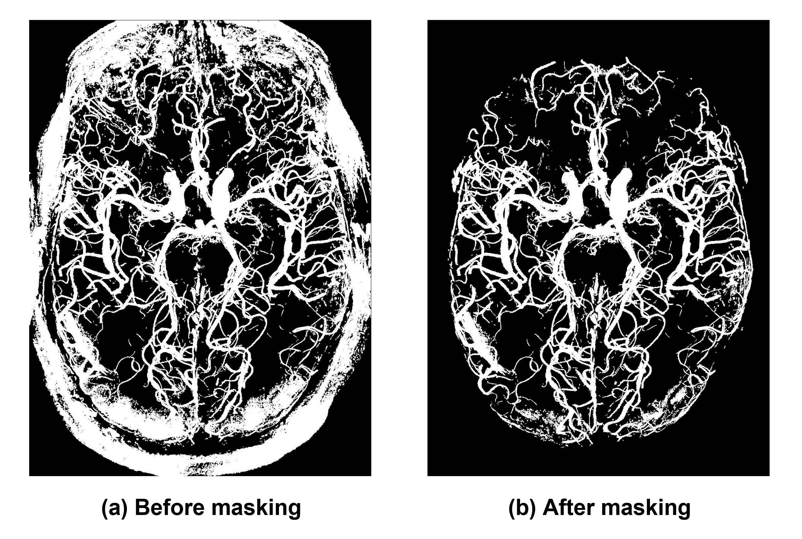

# Summary
*VesselBoost* represents an advanced Python-based software package utilizing deep learning techniques for precise brain arterial vessel segmentation in Time-of-Flight (ToF) angiography. The comprehensive suite encompasses three essential functional modules: a conventional model training module that integrates data augmentation techniques, an inference module, and a test-time adaptation (TTA) module. By leveraging these modules, users gain flexibility and convenience in training and evaluating their own deep-learning models on MRA image data.

One of the distinguishing features of *VesselBoost* lies in its incorporation of TTA, enabling the adaptation of pre-trained model parameters on unlabelled image data. By integrating this approach into the package, it enhances the model's generalizability and effectively mitigates decline in inference performance when encountering test images with variations in distribution, resolution, and other attributes. Consequently, *VesselBoost* significantly empowers neuroscientists, experts, and clinicians, enabling them to effortlessly obtain highly detailed segmentations of the human brain vasculature with excellent accuracy and precision.

# Statement of Need

# Methodology

Our *VesselBoost* application comprises three modules: 1) deep learning model training, 2) inference with our pre-trained models, and 3) test-time adaptation (TTA). At the core of *VesselBoost* is our test-time adaptation module (Module 3) that allows the user to use a provided proxy segmentation or the one generated with our pre-trained model (Module 2) to drive further adaptation of our pre-trained models (Figure 1a). We found that TTA, in combination with data augmentation, can improve the segmentation results beyond the training data (i.e., proxies) and increase sensitivity to small vessels. However, note that our approach is flexible, allowing other developers to contribute with new model architectures and pre-trained models. 

Our pre-trained model consists of a 3D U-Net model [@cicek_2016] initially trained on the SMILE-UHURA challenge 'train' and 'validate' sets. We performed several modifications to the proposed 3D U-Net architecture [@cicek_2016], including increased depth (from 3 to 4 layers in both the encoder and decoder blocks), number of input and output channels equal to 1, and number of convolution filters equal to 16. We implemented these modifications to increase the model's ability to learn complex features, classify vessels only, and reduce training time. Our models were implemented using Python 3.9 and Pytorch 1.13 (REF). 

## Module 1: Deep learning model training
**Training data**: We pre-trained our models using the SMILE-UHURA challenge dataset (https://www.soumick.com/en/uhura/). This dataset was collected as part of the StudyForrest project [@forstmann_multi-modal_2014]. It consists of 3D multi-slab time-of-flight magnetic resonance angiography data acquired at a 7T Siemens MAGNETOM magnetic resonance scanner [@hanke_high-resolution_2014] with an isotropic resolution of 300$\mu$. Twenty right-handed participants (21-38 years, 12 males) participated in the study, but we used 14 samples for model training (the "train" and "validate" sets available through the challenge). 

**Pre-processing**: Input images are pre-processed using N4ITK for bias field correction [@tustison_n4itk_2010] and non-local means denoising [@manjon_adaptive_2010] to increase the signal-to-noise ratio (SNR). 

**Data augmentation**: Our model was pre-trained using randomly cropped patches from the input images and their corresponding labels (or ground-truth segmentations). Each patch was subjected to several augmentation steps to create six different patches. In detail, at each training epoch, the training data were cropped at a random location and size and then resized to 64×64×64 using nearest-neighbor interpolation (patch 1). This procedure is equivalent to zooming in or out for patches smaller or larger than 64×64×64, respectively. Using patch 1, we applied rotation by 90, 180, and 270° (patches 2 – 4) and blurring using two different Gaussian filters (patches 5 and 6). In total, 420,000 training patches were generated (6 patches x 14 subjects x 5,000 training epochs). 

**Training**: We pre-trained three distinct models, each using a specific set of labels: one using manually corrected labels provided for the challenge and the two others using the OMELETTE 1 (O1) and OMELETTE 2 (O2) labels. The OMELLETE labels were generated in an automated fashion (REF) using two different sets of parameters. Each model was trained for 5000 epochs at an initial learning rate of 0.001, which was reduced when the loss reached a plateau (ReduceLROnPlateau (REF)). The Tversky loss [@salehi_tversky_2017] [@chatterjee_ds6_2022] determined the learning objective with α = 0.3 and β = 0.7. 

**Post-processing**: The model's output is post-processed to appropriately convert the predicted probabilities to binary classes by setting the threshold to 0.1. Finally, any connected components with a size smaller than ten voxels are removed [@silversmith:2021]. 
 
## Module 2: Inference with a pre-trained model
Our inference pipeline includes input image pre-processing (Figure 1b, step i), image segmentation using our pre-trained model (Figure 1b, step ii), and post-processing (Figure 1b, step iii). Then, the user can use it for further analysis of the segmentations. 

## Module 3: Test-time adaptation
Test-time adaptation consists of adapting the weights of our pre-trained models using the proxy segmentation as the pseudo-ground-truth to guide parameter optimization (Figure 1a, step ii). The user can specify the number of epochs for the model adaptation. The initial learning rate and the loss function have default configurations equal to 0.001 and the Tversky loss (α = 0.3 and β = 0.7), respectively. Besides, we similarly use ReduceLROnPlateau as the learning rate scheduler. Note, however, that the user can alter these parameters given their need.

# Results
In this section, we present the results of our *VesselBoost* package, focusing on the qualitative evaluation of the TTA module's performance. We used a 3D MRA image slab with voxel size of 150 $\mu m$ for testing, and the resultant image (Fig. 2) demonstrated the software's generalizability when applied to images with varying resolutions. Furthermore, in Fig.2(b), we've chosen 4 patches on the maximum intensity projections (MIP) of the original input image (left column), proxy segmentation generated by the pre-trained model (middle column) and the final segmentation after TTA (right column), these patches showcase *VesselBoost*'s robustness in improving the continuity of the proxy segmentation and exhibiting greater level of details.   

Please note that the current version of *VesselBoost* has some inherent limitations. Given the similarity in intensity between the skull and cerebral vessels in MRA images, the segmentation output may inevitably include false-positive voxels in the vicinity of the skull area. To achieve optimal segmentation of cerebral vasculature, we highly recommend users to apply a brain mask, effectively eliminating any potential skull artifacts from the results. This additional step will further enhance the accuracy and reliability of *VesselBoost*'s segmentation performance (Fig. 3).

Another limitation of our software pertains to the post-processing of segmentations using connected-components analysis [@silversmith:2021], as detailed in the previous section. Notably, a fixed threshold was employed, which may result in the presence of "salt flakes" artifacts in segmentations derived from images with higher resolutions (smaller voxel sizes). To address this concern, we advise users to exercise caution and customize the post-processing parameters based on the specific characteristics of each case. Fine-tuning the post-processing parameters in a case-by-case scenario will enable users to optimize the segmentation outcomes and effectively mitigate any potential artifacts arising from variations in image resolution. This tailored approach ensures greater accuracy and adaptability of our software across diverse imaging datasets (Fig. 4).

# Code Availability

The VesselBoost tool is freely available at (https://osf.io/abk4p/) and via the
Neurodesk data analysis environment (https://neurodesk.github.io) or as Docker and Singularity containers (https://github.com/KMarshallX/vessel_code)

# Acknowledgments

The authors acknowledge funding by NHMRC-NIH BRAIN Initiative Collaborative Research Grant APP1117020 and by the NIH NIMH BRAIN Initiative grant R01-MH111419. FLR acknowledges funding through an ARC Linkage grant (LP200301393). MB acknowledges funding from Australian Research Council Future Fellowship grant FT140100865.

# References