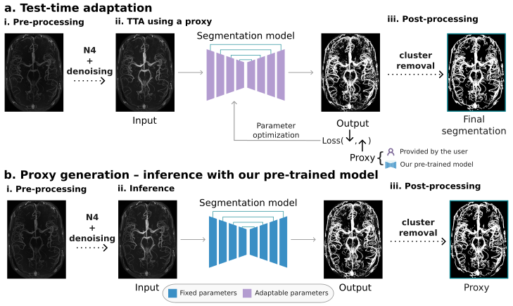
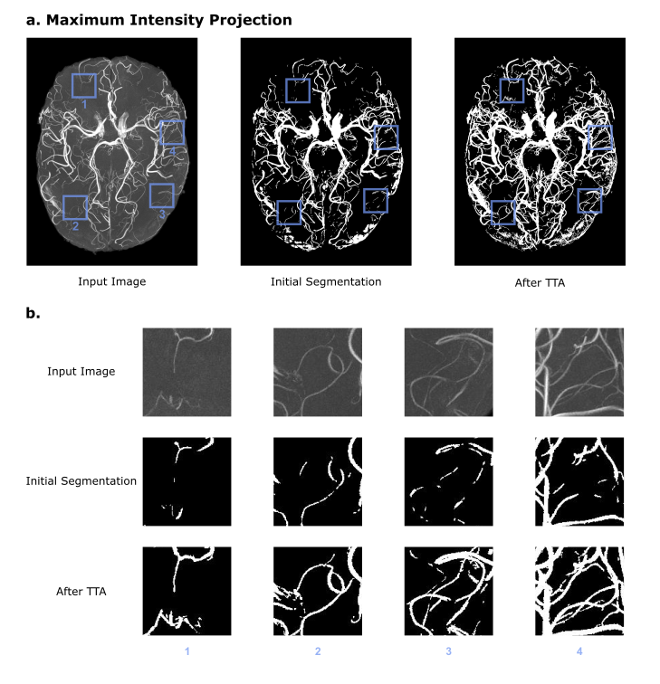
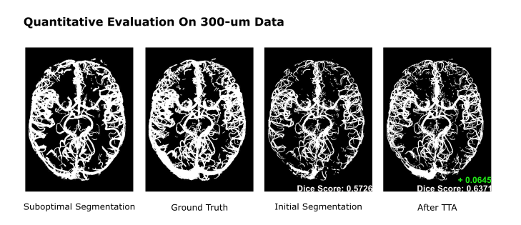

# Summary
*VesselBoost* is a Python-based software package utilizing deep learning techniques for segmentation of high-resolution time-of-flight MRI angiography data with high sensitivity towards small vessels. The software suite encompasses three essential functional modules: a test-time adaptation (TTA) module, an inference module, and a conventional model training module that integrates data augmentation techniques. By leveraging these modules, users can efficiently process high-resolution time-of-flight data or conveniently build models for other vascular MRI image contrasts.

One of the distinguishing features of *VesselBoost* lies in its incorporation of TTA, enabling the adaptation of pre-trained model parameters on unlabelled image data. By integrating this approach into the package, it enhances the model's generalizability, and effectively mitigates decline in inference performance when encountering test images with variations in distribution, resolution, and other attributes. Further, TTA can also be used to improve existing vessel segmentations obtained via traditional methods by re-training the network on this new example data. Consequently, *VesselBoost* can provide detailed segmentations of the human brain vasculature from highest-resolution MRI angiographic imaging [@mattern_prospective_2018].

# Statement of Need
Magnetic resonance angiography (MRA) performed at ultra-high field provides the unique opportunity to study the arteries of the living human brain at the mesoscopic level [@bollmann_imaging_2022]. From this, insights into the blood supply of the brain [@hirsch_topology_2012] and vascular disease affecting small vessels [@hetts_pial_2017; @mcconnell_cerebral_2016] can be gained. To gather quantitative data of human angioarchitecture to — for example — inform modern blood-flow simulations [@park_quantification_2020; @ii_multiscale_2020], detailed segmentations of smallest vessels are required. 

Several challenges arise when segmenting high-resolution MRA data, most notably the difficulty of obtaining large data sets of correctly and comprehensively labeled data. Thus, *VesselBoost* implements the idea of imperfect training labels [@lucena_convolutional_2019] for vascular segmentations. At the core of *VesselBoost* is the TTA module, in which a proxy segmentation containing larger vessels is combined with extensive data augmentation (zooming, rotation, blurring) to sensitise a segmentation model towards smallest vessels. This enables the translation of segmentation models trained on low-resolution data to high-resolution data, without the need for additional manual labelling.

# Methodology
*VesselBoost* comprises three modules: 1) test-time adaptation (TTA), 2) inference with pre-trained models, and 3) deep learning model training. At the core of *VesselBoost* is the TTA module (Module 1) that allows the user to provide a proxy segmentation or generate a proxy with our pre-trained model (Module 2) to drive further adaptation of the pre-trained models (Figure 1a). We found that TTA, in combination with data augmentation, can improve the segmentation results beyond the training data (i.e., proxies) and increase sensitivity to small vessels. However, note that this approach is flexible, allowing other developers to contribute with new model architectures and pre-trained models. 

The pre-trained model consists of a 3D U-Net model [@cicek_2016] initially trained on the SMILE-UHURA challenge 'train' and 'validate' sets (https://www.soumick.com/en/uhura/). We performed several modifications to the proposed 3D U-Net architecture [@cicek_2016], including increased depth (from 3 to 4 layers in both the encoder and decoder blocks), number of input and output channels equal to 1, and number of convolution filters equal to 16. We implemented these modifications to increase the model's ability to learn complex features, classify vessels only, and reduce training time. Our models were implemented using Python 3.9 and Pytorch 1.13 [@paszke_automatic_2017]. 

## Module 1: Test-time adaptation
**Pre-processing**: Input images are pre-processed using N4ITK for bias field correction [@tustison_n4itk_2010] and non-local means denoising [@manjon_adaptive_2010] to increase the signal-to-noise ratio (SNR).
**Data augmentation**: Data augmentation was performed to increase the amount of training data and leverage the self-similarity of large and small vessels. At each epoch, the input data were cropped at a random location and size and then resized to 64×64×64 using nearest-neighbor interpolation (patch 1). This procedure is equivalent to zooming in or out for patches smaller or larger than 64×64×64, respectively. Using patch 1, we applied rotation by 90, 180, and 270° (patches 2 – 4) and blurring using two different Gaussian filters (patches 5 and 6), generating 6 patches at each epoch. 
**Test-time adaptation**
Test-time adaptation consists of adapting the weights of the pre-trained models using a proxy segmentation as the pseudo-ground-truth to guide parameter optimization (Figure 1a, step ii). The user can specify the number of epochs for the model adaptation. The initial learning rate and the loss function have default configurations equal to 0.001 and the Tversky loss (α = 0.3 and β = 0.7), respectively. Besides, the default learning rate scheduler is the ReduceLROnPlateau (available through PyTorch [@paszke_automatic_2017]), which automatically reduces the learning rate when the loss reaches a plateau.
**Post-processing**: The model's output is post-processed to appropriately convert the predicted probabilities to binary classes by setting the threshold to 0.1. Finally, any connected components with a size smaller than ten voxels are removed [@silversmith:2021]. 

## Module 2: Inference with a pre-trained model
The inference pipeline includes input image pre-processing (Figure 1b, step i), image segmentation using a pre-trained model (Figure 1b, step ii), and post-processing (Figure 1b, step iii). This allows the user to perform additional processing on the provided proxy before using it in the TTA module.

## Module 3: Deep learning model training
**Training data**: We pre-trained the models using the SMILE-UHURA challenge dataset (https://www.soumick.com/en/uhura/). This dataset was collected as part of the StudyForrest project [@forstmann_multi-modal_2014]. It consists of 3D multi-slab time-of-flight magnetic resonance angiography (MRA) data acquired at a 7T Siemens MAGNETOM magnetic resonance scanner [@hanke_high-resolution_2014] with an isotropic resolution of 300$\mu$. Twenty right-handed participants (21-38 years, 12 males) participated in the study, but we used 14 samples for model training (the "train" and "validate" sets available through the challenge). 

**Training**: We pre-trained three distinct models, each using a specific set of labels: one using manually corrected labels provided for the challenge and the two others using the OMELETTE 1 (O1) and OMELETTE 2 (O2) labels. The OMELLETE labels were generated in an automated fashion [@mattern_2021] using two different sets of parameters. Each model was trained for 5000 epochs at an initial learning rate of 0.001, which was reduced when the loss reached a plateau using ReduceLROnPlateau. The Tversky loss [@salehi_tversky_2017] [@chatterjee_ds6_2022] determined the learning objective, with α = 0.3 and β = 0.7. 

# Results
## Qualitative evaluation
To qualitatively evaluate our software, we used a 3D MRA image slab with an isotropic resolution of 150 $\mu m$. \autoref{fig:2}a shows the maximum intensity projections (MIP) of the original input image, the proxy segmentation generated by our pre-trained model, and the final segmentation after test-time adaptation. In \autoref{fig:2}b, we illustrate 'zoomed in' patches of the images shown in panel a. These patches showcase *VesselBoost*'s robustness in improving the continuity of the proxy segmentation by leveraging TTA to boost upon this coarser segmentation. Overall, we found that even though our models were trained on lower resolution data, it can be generalized to images with varying resolutions.

## Quantitative evaluation
To quantitatively evaluate the test-time adaptation module, we pre-trained a model using a set of suboptimal segmentations (O1) and used for fintuning on an image date with an isotropic resolution of 300 $\mu m$. We compared the Dice score of the segmentation generated by the pre-trained model and the segmentation after test-time adaptation. As shown in \autoref{fig:3}, the Dice score increased from 0.5726 to 0.0.6371 after test-time adaptation. This result demonstrates that our test-time adaptation module can improve the segmentation accuracy of our pre-trained model.

## Other considerations
As with any deep learning model, our segmentation model is susceptible to distribution shifts and has limited performance under certain conditions. Specifically, our models were trained on images with intact skulls. Given the similarity in the intensity of the skull and cerebral vessels in MRA images, the segmentation output may inevitably include false-positive voxels near the skull area. Moreover, more false positives are detected near or around the dura when we infer in images without the skull. Thus, to achieve optimal segmentation of cerebral vasculature, we highly recommend users apply a brain mask after inference / TTA to eliminate any potential skull artifacts from the results. This additional step will further enhance the accuracy and reliability of *VesselBoost*'s segmentation performance (\autoref{fig:4}a).

Moreover, please note we use a fixed threshold for connected-components analysis [@silversmith:2021] to remove disconnected components (this argument is denoted as "cc"), which may not be generalizable to images with different resolutions. For example, in images with higher resolution, our default threshold, cc = 10, might lead to "salt flakes" artifacts in segmentations, as shown in \autoref{fig:4}b. However, our software is flexible to the user's requirement, allowing for the customization of post-processing parameters. Fine-tuning the post-processing parameters in a case-by-case scenario will enable users to optimize the segmentation outcomes and effectively mitigate any potential artifacts arising from variations in image resolution. This tailored approach ensures greater accuracy and adaptability of our software across diverse imaging datasets.

# Code Availability

The VesselBoost tool is freely available at (https://osf.io/abk4p/) and via the
Neurodesk data analysis environment (https://neurodesk.github.io) or as Docker and Singularity containers (https://github.com/KMarshallX/vessel_code)

# Acknowledgments

The authors acknowledge funding by NHMRC-NIH BRAIN Initiative Collaborative Research Grant APP1117020 and by the NIH NIMH BRAIN Initiative grant R01-MH111419. FLR acknowledges funding through an ARC Linkage grant (LP200301393). MB acknowledges funding from Australian Research Council Future Fellowship grant FT140100865.

Part of this work ... mention SMILE-UHURA challenge

# References
