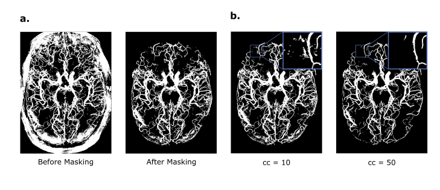

# Summary
*VesselBoost* is a Python-based software package utilizing deep learning techniques to segment high-resolution time-of-flight MRI angiography data, with high sensitivity towards small vessels. The software suite encompasses three functional modules: (1) *predict*, (2) *test-time adaptation* (TTA), and (3) *boost*. By leveraging these modules, users can efficiently segment high-resolution time-of-flight data or conveniently 'boost' segmentations for other vascular MRI image contrasts.

One of the distinguishing features of *VesselBoost* lies in its incorporation of the idea of imperfect training labels for vasculature segmentation. At the core of *VesselBoost* is a data augmentation strategy that leverages the self-similarity of large and small vessels, which sensitise a segmentation model towards the smallest vessels. This allows to 'boost' coarse segmentations and increase the number of segmented, small vessels. In summary, *VesselBoost* can provide detailed segmentations of the human brain vasculature from high-resolution MRI angiographic imaging, using either *predict* or *test-time adaptation*, or it can *boost* segmentations for other vascular MRI image contrasts.

# Statement of Need
Magnetic resonance angiography (MRA) performed at ultra-high field provides the unique opportunity to study the arteries of the living human brain at the mesoscopic level [@bollmann_imaging_2022]. From this, we can gain new insights into the brain's blood supply [@hirsch_topology_2012] and vascular disease affecting small vessels [@hetts_pial_2017; @mcconnell_cerebral_2016]. However, to gather quantitative data on human angioarchitecture to — for example — inform modern blood-flow simulations [@park_quantification_2020; @ii_multiscale_2020], detailed segmentations of the smallest vessels are required. 

Several challenges arise when segmenting high-resolution MRA data, most notably the difficulty of obtaining large data sets of correctly and comprehensively labeled data. Thus, *VesselBoost* implements the idea of imperfect training labels [@lucena_convolutional_2019] for vasculature segmentation. At the core of *VesselBoost* is a data augmentation strategy that leverages the self-similarity of large and small vessels, which sensitise a segmentation model towards the smallest vessels, enabling 'boosting' of coarser, imperfect segmentations. 

# Methodology
*VesselBoost* comprises three main modules: 1) *predict*, 2) test-time adaptation (*TTA*), and 3) *boost*. These modules are designed to capture different levels of similarity between the original training data and the new data. If the properties of the new data are close to the original training data, *predict* can be directly applied to the new data. *TTA* will be useful if the new data is somewhat similar, but some adaptation of the network is needed. *Boost* utilises the same preprocessing and data augementation strategies, but trains a new network completely from scratch. Thus, *boost* caters for cases when the new data is significantly different from the original training data, for example when using a different vascular MRI contrast.

At the core of *VesselBoost* is a data augmentation strategy that leverages the self-similarity of large and small vessels, which sensitise a segmentation model towards the smallest vessels. Using our pre-trained models, users can segment high-resolution time-of-flight data with *predict* (Module 1). The *TTA* module (Module 2) allows the user to provide a proxy segmentation, or generate a proxy with our pre-trained model (Module 1), to drive further adaptation of the pre-trained models. We found that TTA, in combination with data augmentation, can improve the segmentation results beyond the training data (i.e., proxies) and increase sensitivity to small vessels. Finally, the *boost* module (Module 3) allows users to train a segmentation model on a new data set using existing imperfect segmentation. This module is particularly useful for users who have access to a small number of labeled data and want to boost small vessel segmentation. The key difference between *TTA* and *boost* is that the latter allows users to train a model from scratch, whereas the former adapts a pre-trained model.

The pre-trained model consists of a 3D U-Net model [@cicek_2016] initially trained on the SMILE-UHURA challenge "train" and "validate" sets [@Chatterjee_Mattern_Dubost_Schreiber_Nürnberger_Speck_2023]. We performed several modifications to the proposed 3D U-Net architecture [@cicek_2016], including increased depth (from 3 to 4 layers in both the encoder and decoder blocks), number of input and output channels equal to 1, and number of convolution filters equal to 16. We implemented these modifications to increase the model's ability to learn complex features, classify vessels only, and reduce training time. The models were implemented using Python 3.9 and Pytorch 1.13 [@paszke_automatic_2017]. 

The SMILE-UHURA challenge dataset [@Chatterjee_Mattern_Dubost_Schreiber_Nürnberger_Speck_2023] was collected as part of the StudyForrest project [@forstmann_multi-modal_2014]. It consists of 3D multi-slab time-of-flight magnetic resonance angiography (MRA) data acquired at a 7T Siemens MAGNETOM magnetic resonance scanner [@hanke_high-resolution_2014] with an isotropic resolution of 300$\mu$m. Twenty right-handed individuals (21-38 years, 12 males) participated in the study, but we used 14 samples for model training (the "train" and "validate" sets available through the challenge). Before model training, the MRA data were pre-processed as described below.

Data augmentation was performed to increase the amount of training data and to leverage the self-similarity of large and small vessels. The input data were cropped at random locations and sizes at each training epoch and then resized to 64×64×64 using nearest-neighbor interpolation (patch 1). This procedure is equivalent to zooming in or out for patches smaller or larger than 64×64×64. We generated multiple copies (5 more copies per patch) of each of these patches and applied rotation by 90°, 180°, and 270° (copies 1-3) or blurring using two different Gaussian filters (copies 4 and 5) were applied, totalling six copies per patch at each epoch.  Four patches (or batch size equal to 4) are generated for each input data and training epoch.

We pre-trained three distinct models, each using a specific set of labels: one using manually corrected labels provided for the challenge and the two others using the OMELETTE 1 (O1) and OMELETTE 2 (O2) labels. The OMELLETE labels were generated in an automated fashion [@mattern_2021] using two different sets of parameters. Each model was trained for 5000 epochs at an initial learning rate of 0.001, which was reduced when the loss reached a plateau using ReduceLROnPlateau. The Tversky loss [@salehi_tversky_2017; @chatterjee_ds6_2022] determined the learning objective, with α = 0.3 and β = 0.7.

## Module 1: Predict
The prediction pipeline includes input image pre-processing (\autoref{fig:1}a, step i), image segmentation using a pre-trained model (\autoref{fig:1}b, step ii), and post-processing (\autoref{fig:1}b, step iii). This module provides extra flexibility for users to manipulate post-processing parameters to obtain a more suitable proxy before, for example, using it for TTA.

**Pre-processing**: Input images are pre-processed using N4ITK for bias field correction [@tustison_n4itk_2010] and non-local means denoising [@manjon_adaptive_2010] to increase the signal-to-noise ratio (SNR) (\autoref{fig:1}a, step i).

**Post-processing**: The model's output is post-processed to appropriately convert the predicted probabilities to binary classes by setting the threshold to 0.1. Finally, any connected components with a size smaller than ten voxels are removed [@silversmith:2021]. 

## Module 2: Test-time adaptation

Test-time adaptation consists of adapting the weights of pre-trained models using a proxy segmentation as the pseudo-ground-truth to guide parameter optimization (\autoref{fig:1}b, step ii). The user can specify the number of epochs for the model adaptation. The initial learning rate and the loss function have default configurations equal to 0.001 and the Tversky loss (α = 0.3 and β = 0.7), respectively. The default learning rate scheduler is the ReduceLROnPlateau (available through PyTorch [@paszke_automatic_2017]), which automatically reduces the learning rate when the loss reaches a plateau.

## Module 3: Boost

*Boost* (Module 3) allows users to train a segmentation model from scratch using imperfect segmentation from a new data set. This module is beneficial for users who have access to a small number of labeled data and want to boost small vessel segmentation. This module shares the general training settings previously described, but the user can specify the number of training epochs.

# Results
## Quantitative evaluation

To quantitatively evaluate the TTA module, we trained a model using 13 MRA images from the SMILE-UHURA challenge [@Chatterjee_Mattern_Dubost_Schreiber_Nürnberger_Speck_2023], leaving one sample out for evaluation. Specifically, we used the set of coarse segmentations (OMELETTE 1) for model training for 5000 epochs. Then, this pre-trained model was used for proxy generation and adapted for 100 epochs using our TTA module and the test image. To remove unwanted false-positive voxels from outside the brain, a semi-automatically derived brain mask was applied. \autoref{fig:2} shows the coarse segmentation (O1), the ground-truth (or manually annotated) segmentation, the initial segmentation (proxy), and the final segmentation after TTA for the test image. Using the manually annotated segmentation as reference, the final segmentation after TTA showed an increase in Dice score of 0.06 compared to the initial proxy segmentation.

## Qualitative evaluation

To qualitatively evaluate our software, we used a 3D MRA image slab with an isotropic resolution of 150 $\mu$m [@mattern_prospective_2018]. \autoref{fig:3}a shows the maximum intensity projections (MIP) of the original input image, the proxy segmentation generated by our pre-trained model, and the final segmentation after test-time adaptation. To remove unwanted false-positive voxels from outside the brain, a semi-automatically derived brain mask was applied. In \autoref{fig:3}b, we illustrate 'zoomed in' patches of the images shown in panel **a**. These patches showcase *VesselBoost*'s robustness in improving the continuity of the proxy segmentation by leveraging TTA to boost upon this coarser segmentation. Overall, we found that even though our models were trained on lower resolution data, it can be generalized to images with varying resolutions.

## Other considerations
As with most deep learning models, our segmentation model is susceptible to distribution shifts and has limited performance under certain conditions. Specifically, our models were trained on images without any brain mask applied. Given the similarity in the intensity of skin or fat and cerebral vessels in MRA images, the segmentation output may inevitably include false-positive voxels outside the brain. Thus, to achieve optimal segmentation of cerebral vasculature, we recommend users apply a brain mask after prediction / TTA to eliminate any potential artifacts from skin or fat. This additional step will further enhance the accuracy and reliability of *VesselBoost*'s segmentation performance (\autoref{fig:4}a).

Moreover, throughout our  assessment, we use a fixed threshold for connected-components analysis [@silversmith:2021] to remove disconnected components (which is denoted as "cc" in \autoref{fig:4}b). This may not generalize to images with different resolutions. For example, the default threshold is cc = 10, which might lead to "salt flakes" artifacts in segmentations in images with higher resolution, as shown in \autoref{fig:4}b. Fine-tuning the post-processing parameters in a case-by-case scenario will enable users to optimize the segmentation outcomes and effectively mitigate any potential artifacts arising from variations in image resolution.

# Code Availability

The VesselBoost tool is freely available at [Open Science Framework](https://osf.io/abk4p/), [GitHub](https://github.com/KMarshallX/vessel_code) and via the
Neurodesk [@renton_neurodesk_2023] data analysis environment (https://neurodesk.github.io) as Docker and Singularity containers.  

# Acknowledgments

The authors acknowledge funding by NHMRC-NIH BRAIN Initiative Collaborative Research Grant APP1117020 and by the NIH NIMH BRAIN Initiative grant R01-MH111419. FLR acknowledges funding through an ARC Linkage grant (LP200301393). HM acknowledges funding from the Deutsche Forschungsgemeinschaft (DFG) (501214112, MA 9235/3-1) and the Deutsche Alzheimer Gesellschaft (DAG) e.V. (MD-DARS project). MB acknowledges funding from Australian Research Council Future Fellowship grant FT140100865.

An early prototype of this work was presented at the 12th Scientific Symposium on Clinical Needs, Research Promises and Technical Solutions in Ultrahigh Field Magnetic Resonance in Berlin in 2021. This work was also submitted to the SMILE-UHURA challenge [@Chatterjee_Mattern_Dubost_Schreiber_Nürnberger_Speck_2023].

# References
